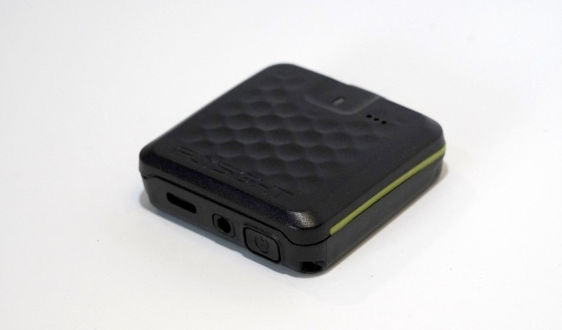

# Introducing the Sw00pGenerator3000 (SG3K) - Your Ultimate Swooping Companion!

 

The Sw00pGenerator3000, or SG3K, is a cutting-edge GPS analysis tool meticulously crafted to empower swoopers at every level of expertise. Whether you're taking your first plunge into the exhilarating world of swooping or you're a seasoned competitor seeking continuous improvement, the SG3K is your key to accelerating your learning curve. With this advanced tool, you can make remarkable progress in refining your performance while minimizing the number of jumps needed.

 

 

But wait, what's swooping without FlySight? FlySight is not your ordinary GPS; it's tailor-made for wingsuit pilots and introduces a revolutionary feature. Providing real-time audible indications of glide ratio, horizontal, or vertical speed, FlySight takes your flying experience to new heights. For more detailed information on FlySight, check out this [link](https://github.com/flysight/flysight).

Now, let's talk about FlySight 2 - a complete redesign that builds on the success of its predecessor. Featuring real-time audible feedback using tones and speech, you can review your jump data using the same applications you loved with FlySight 1. The new FlySight 2 boasts additional enhancements, including a water-resistant case (IP67), a more powerful processor with Bluetooth Low Energy radio, and extra sensors (acceleration, rotation, orientation, pressure, humidity, temperature) for a comprehensive analysis of your flight. With improved audio and the convenience of USB C, FlySight 2 takes your swooping experience to the next level.

For those who crave the technical details, let's take a peek into the comparison of FlySight Gen1 and FlySight Gen2 Track data:

 

<table>
<tr><th align="center">Flysight Gen1 - Track data</th><th align="center">Flysight Gen2 - Track data</th></tr>

<tr><td>

| **Name** | **Unit** | **Description**                    |
| :------- | :------- | :--------------------------------- |
| time     | datetime | Time in ISO8601 format             |
| lat      | deg      | Latitude                           |
| lon      | deg      | Longitude                          |
| hMSL     | m        | Height above mean sea level        |
| velN     | m/s      | NED north velocity                 |
| velE     | m/s      | NED east velocity                  |
| velD     | m/s      | NED down velocity                  |
| hAcc     | m        | Horizontal Accuracy Estimate       |
| vAcc     | m        | Vertical Accuracy Estimate         |
| sAcc     | m/s      | Speed Accuracy Estimate            |
| heading  | deg      | Heading of motion 2-D              |
| cAcc     | deg      | Course / Heading Accuracy Estimate |
| gpsFix   | -        | GPSfix Type (3 = 3D)               |
| numSV    | -        | # of satellites following.         |

</td><td>

| **Name** | **Unit** | **Description**              |
| :------- | :------- | :--------------------------- |
| time     | datetime | Time in ISO8601 format       |
| lat      | deg      | Latitude                     |
| lon      | deg      | Longitude                    |
| hMSL     | m        | Height above mean sea level  |
| velN     | m/s      | NED north velocity           |
| velE     | m/s      | NED east velocity            |
| velD     | m/s      | NED down velocity            |
| hAcc     | m        | Horizontal Accuracy Estimate |
| vAcc     | m        | Vertical Accuracy Estimate   |
| sAcc     | m/s      | Speed Accuracy Estimate      |
| numSV    | -        | # of satellites following.   |
| -        | -        | -                            |
| -        | -        | -                            |
| -        | -        | -                            |

</td></tr> </table>

The FlySight2 includes supplementary sensor data, comprising the following information:

- **BARO:** time(s), pressure(Pa), temperature(deg C)
- **HUM:** time(s), humidity(percent), temperature(deg C)
- **MAG:** time(s), x(gauss), y(gauss), z(gauss), temperature(deg C)
- **IMU:** time(s), wx(deg/s), wy(deg/s), wz(deg/s), ax(g), ay(g), az(g), temperature(deg C)
- **TIME:** time(s), tow(s), week
- **VBAT:** time(s), voltage(volt)

It's important to note that as of now, this additional data is not utilized in the current application.

For the comprehensive technical specifications FlySight 2, refer to the official documentation [link](https://content.u-blox.com/sites/default/files/products/documents/u-blox6_ReceiverDescrProtSpec_%28GPS.G6-SW-10018%29_Public.pdf). Get ready to elevate your swooping experience with the SG3K and FlySight 2 - the perfect duo for soaring to new heights!
